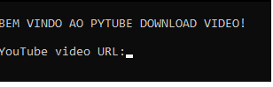

# pytube.exe

Downloading Youtube videos with Pytube using a file.exe.

### Install modules

```
pip install -r requirements.txt
```

### Using pyinstaller

```
pyinstaller -F pytube_program.py
```

### PROMPT


